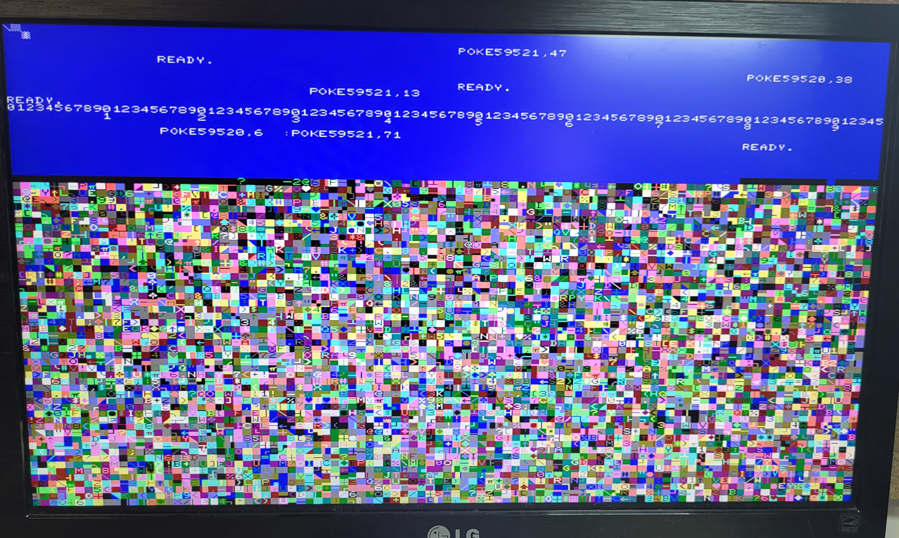
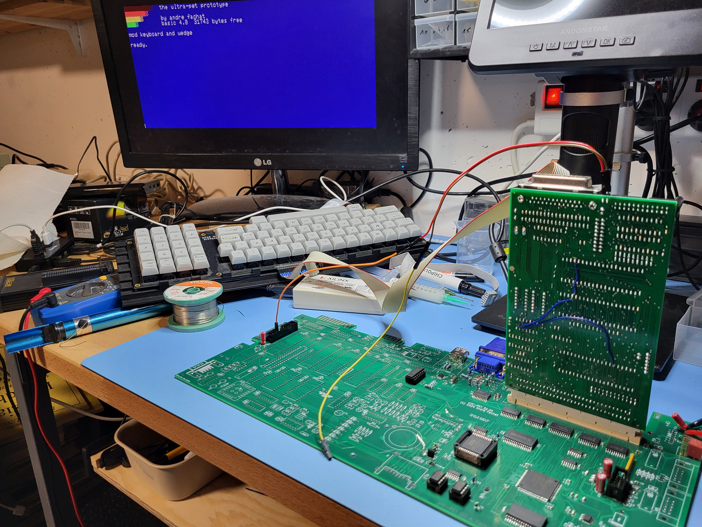

= Micro-PET family

This is the root repository for a number of 8-bit retro machines, mainly clones of the Commodore PET - but with many more features. 
This is a family of boards with a set of core features, and different additional features depending on the board variant.

The *Ultra-CPU* core is based on my CS/A bus system, and as an FPGA is used that contains the memory mapping, could be used in different types of system, not just the PET.

The *Micro-PET* is the core, plus all the standard PET I/O, mainly IEEE488, keyboard, and tape (but without 9V), on a single 100x190mm board.

The *Ulti-PET* finally, is a fully integrated PET clone, with many many features. Most notably, I used the 6502.org original SPI-10 specs and included a 5V (based on the VIA SR), and a 3.3V (based on the FPGA) variant. Also, an UEXT connector is on board, including I2C, 3.3V-TTL serial, and SPI (based on the FPGA SPI interface).

image::images/family.jpg[The Micro-PET family]

== Features

All variants center around a set of core features, as implemented in the Ultra-CPU board. The core specs are:

=== Ultra-CPU

* CS/A bus-based 65816 CPU board
* Up to 17.5 MHz 65816 CPU, with 1MB RAM (512k fast, 512k media RAM)
* 768x576 VGA with 16 colours out of 64, various modes incl. Colour-PET and C64-alike, incl. sprites
* USB host for keyboard and mouse
* DAC (DMA) audio output
* Port for SD-Card adapter (2 variants)
* Port for Network, with either Ethernet or Wifi options

=== Micro-PET

The Micro-PET removes the CS/A bus connector, but adds:

* Standard PET I/O, plus ability to work as IEEE488 device

=== Ulti-PET

The Ulti-PET integrates, on top of the Micro-PET, the following features from other CS/A bus boards

* (Fast) Serial IEC, incl. ability to work as IEC device, based on the VIA SR
* RS232, plus 2nd TTL serial (shared with UEXT)
* Dual SID with mixer (that includes the DAC audio and the beeper); Speaker amp included.
* Keyboard shift lock / reset (needs Shift lock key on separate keyboard matrix position)
and adds these features on top:
* 2 Joystick ports, switchable between single- and dual mode ("stupid pet tricks" compatible)
* SPI-10 5V, SPI-10 3.3V, and UEXT extension ports (partially shared, see schematics), incl. I2C
* Fully functional Tape incl. 9V for Tape drive power supply
* Expansion ports for the CS/A bus - single wide port, single shortbus port for Ultrabus expansion board
* Accompanying bus extender board to use CS/A, RC2014, Apple-II, or C64 cards

== Build

To build the boards, a few core repositories are required that contain shared code (FPGA, Firmware) in addition to the
specific repositories for each board. Also, there are further options like Wifi, or the bus extender.

All repositories contain gerber files and BOMs (of varying quality) where PCBs are included. Most of them are designed
with KiCAD, one is still with Eagle.

The CS/A bus boards are extensions that can be used with the Ultra-CPU or the Ulti-PET. Care needs to be taken to match
the respective I/O ranges used to avoid bus conflicts.

=== Core repos

* https://github.com/fachat/upet_roms[Firmware repository]
* https://github.com/fachat/upet_fpga[FPGA configuration repository]

=== Specific boards

* https://github.com/fachat/csa_ultracpu[The Ultra-CPU board]
* https://github.com/fachat/cbm_micropet[The Micro-PET board]
* https://github.com/fachat/cbm_ultipet[The Ulti-PET board]
 
=== Optional boards

* https://github.com/fachat/upet_wifi[Wifi breakout board] (Note: so far untested)
* https://github.com/fachat/csa_ultrabus[Bus for Ultra-CPU or bus extender for Ulti-PET]

=== CS/A bus boards

The PETIO board completes the Ultra-CPU to a PET clone:

* http://www.6502.org/users/andre/csa/petio/index.html[PETIO CS/A board for the Ultra-CPU]

Other CS/A bus boards are here http://www.6502.org/users/andre/csa/index.html[]

== Gallery

The boot screen

image::images/boot.jpg[The boot screen]

A demo showing the graphics capabilities

image::images/graphdemo.jpg[A demo showing the graphics capabilities]

The highest character resolution, 96x71

Development of the board with new PET start screen

Running GeckOS in 8296 emulation mode

image::images/geckos8296.jpg[Running GeckOS in 8296 emulation mode]

